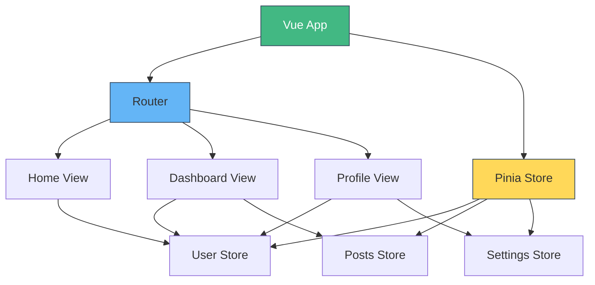
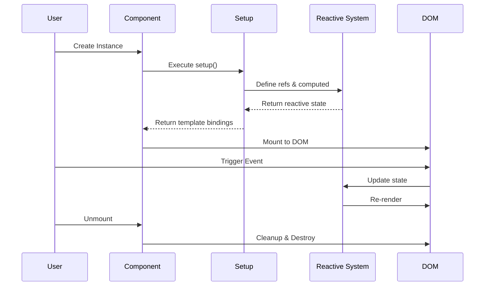
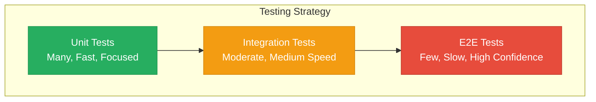
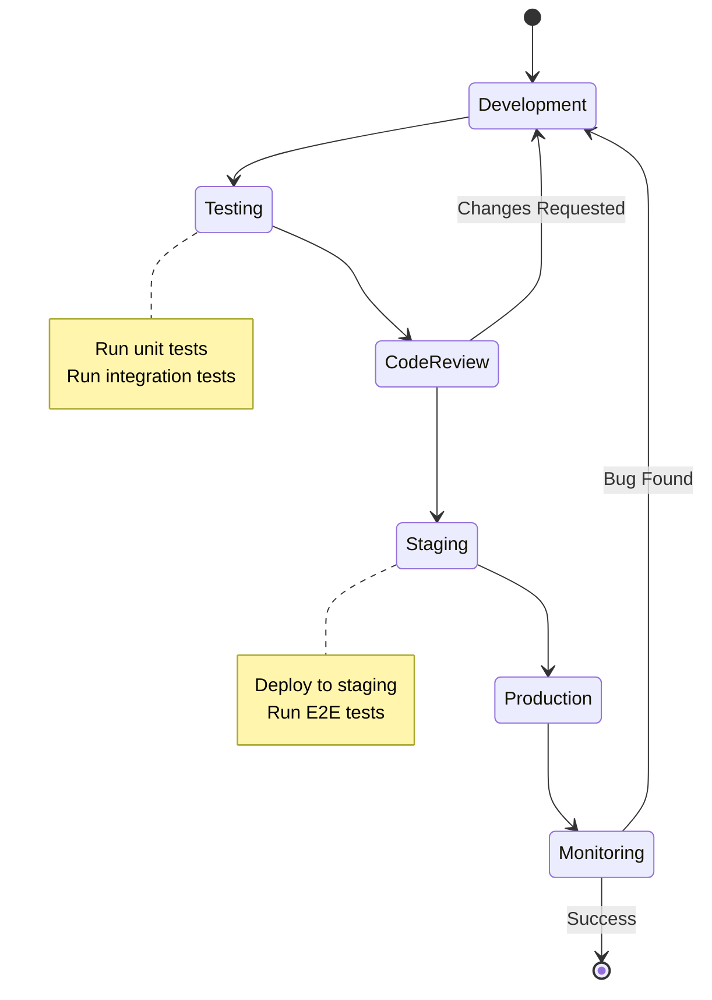

# Building Modern Web Applications with Vue and TypeScript


Modern web development has evolved significantly over the past few years. With frameworks like Vue.js 3 and the power of TypeScript, building scalable and maintainable applications has become more accessible than ever.

## Why Vue 3 and TypeScript?

Vue 3 introduced the Composition API, which provides better TypeScript integration and improved code organization. Combined with TypeScript's static typing, this creates a robust development experience.

### Key Benefits

1. **Type Safety**: Catch errors during development, not in production
2. **Better IDE Support**: Enhanced autocomplete and refactoring tools
3. **Improved Maintainability**: Self-documenting code through type annotations
4. **Scalability**: Easier to manage large codebases

## Project Setup

Setting up a Vue 3 project with TypeScript is straightforward using Vite:

```bash
npm create vite@latest my-app -- --template vue-ts
cd my-app
npm install
npm run dev
```

This gives you a production-ready setup with hot module replacement and optimized builds.

## Component Best Practices

Using TypeScript with Vue components provides excellent type inference:

```typescript
<script setup lang="ts">
import { ref, computed } from 'vue'

interface User {
  id: number
  name: string
  email: string
}

const users = ref<User[]>([])
const activeUsers = computed(() => 
  users.value.filter(u => u.email.includes('@'))
)
</script>
```

## Styling with TailwindCSS


TailwindCSS v4 brings CSS-first configuration and improved performance. The new `@theme` directive makes customization intuitive:

```css
@import "tailwindcss";

@theme {
  --color-primary-50: #eff6ff;
  --color-primary-600: #2563eb;
  --color-primary-700: #1d4ed8;
}
```

## State Management

For complex applications, consider Pinia for state management:

```typescript
import { defineStore } from 'pinia'

export const useUserStore = defineStore('user', {
  state: () => ({
    currentUser: null as User | null,
    isAuthenticated: false
  }),
  actions: {
    async login(credentials: LoginCredentials) {
      // Implementation
    }
  }
})
```

### Application Architecture

Here's a typical Vue application architecture with Pinia state management:



The diagram shows how Vue Router and Pinia work together to create a scalable application structure.

### Component Lifecycle

Understanding the Vue 3 Composition API lifecycle:



## Testing Strategy

A solid testing strategy includes:

- **Unit Tests**: Test individual components and utilities
- **Integration Tests**: Verify component interactions
- **E2E Tests**: Validate complete user workflows

### Testing Pyramid



```typescript
import { describe, it, expect } from 'vitest'
import { mount } from '@vue/test-utils'
import MyComponent from './MyComponent.vue'

describe('MyComponent', () => {
  it('renders properly', () => {
    const wrapper = mount(MyComponent, {
      props: { title: 'Test' }
    })
    expect(wrapper.text()).toContain('Test')
  })
})
```

## Performance Optimization

Key optimization strategies:

1. **Code Splitting**: Use dynamic imports for route-based splitting
2. **Lazy Loading**: Load components on-demand
3. **Image Optimization**: Use modern formats (WebP, AVIF)
4. **Caching**: Leverage browser caching and service workers

### Development Workflow



## Conclusion

Building modern web applications with Vue 3 and TypeScript creates a solid foundation for scalable, maintainable projects. The combination of strong typing, reactive composition, and modern tooling makes development both productive and enjoyable.

Start small, follow best practices, and iterate based on your application's needs. The ecosystem continues to evolve, bringing new tools and patterns that make web development better every day.

---

*This is a sample blog post demonstrating markdown formatting, code blocks, image embedding, and various Mermaid diagram types (flowchart, sequence, graph, state diagram).*
